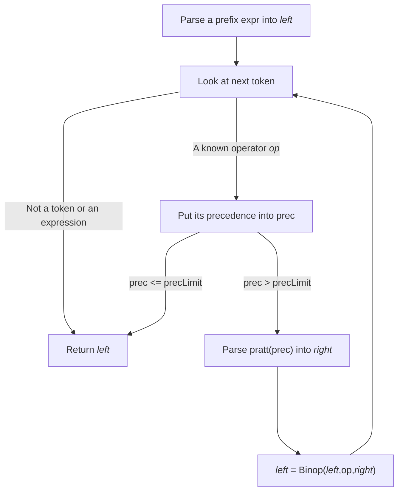

# Monkey

Building an Interpreter with Go. Following [Writing an Interpreter in GO - By Thorsten Ball](https://interpreterbook.com/)

## Pratt parsing algorithm

```mermaid
flowchart TD
A["`Parse a prefix expr into *left*`"] --> B[Look at next token]
B --> |Not a token or an expression| C["`Return *left*`"]
B ---->|"`A known operator *op*`"| E[Put its precedence into prec]
E ---->|prec <= precLimit| C
E ---->|prec > precLimit| F["`Parse pratt(prec) into *right*`"]
F ----> G["`*left* = Binop(*left*,op,*right*)`"]
G ----> B
```
